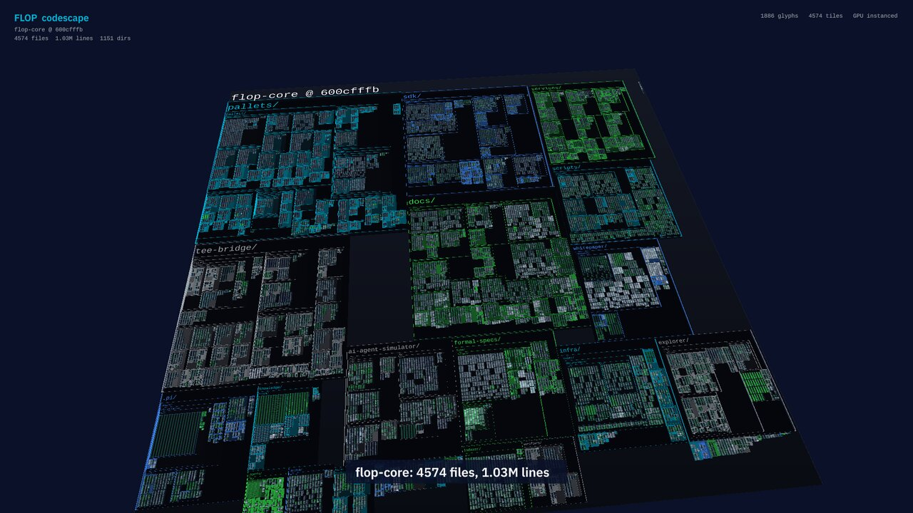
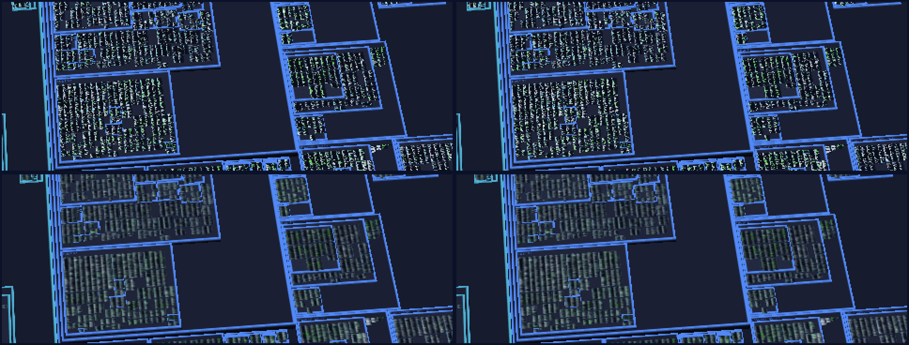

# codescape

A 3D map of the flop-core source that you can fly through, built on
[Makepad](https://github.com/makepad/makepad). It is inspired by Rik Arends'
Makepad source visualizer.



Each directory is a raised block, and nested directories stack on top of their
parent. Each file is a flat tile holding its real text, split into columns so
the tile stays roughly square. Blocks take an accent colour from their
top-level directory; larger directories get cyan, green and blue first.

It uses two levels of detail:

- **Far:** every file is one quad. It samples a mipmapped minimap atlas where
  each texel covers two characters of one line, coloured by syntax class.
  The whole repo (about 4.6k files and 1M lines) costs about 4.6k quads.
- **Near:** files that appear large on screen also get one quad per
  character, drawn from a signed-distance-field font atlas. Nearest files come
  first, up to 450k glyphs, and the text stays sharp at any zoom.

A scan and layout of flop-core takes about 0.6 s. All text is uploaded once;
the camera changes only uniforms and the near-glyph set.

## Build

The crate is split in two. The library (`src/lib.rs`) holds everything that
decides how the tool behaves and scales — scanning, layout, the minimap
rasteriser, overlays, and the scene geometry that chooses each frame's glyphs.
The binary adds the Makepad renderer on top. Nothing in the library touches
Makepad, so its tests and the benchmark build and run on a machine with no GPU,
no X server and no GUI development packages:

```sh
cargo test --lib --no-default-features      # or: just verify-codescape
cargo run  --release --no-default-features --bin bench
```

The renderer itself needs the libraries any Makepad app links against:

```sh
sudo apt-get install libx11-dev libxcursor-dev libasound2-dev libpulse-dev
```

Makepad declares its own FFI, so no C headers are involved: the only thing
those packages contribute to the build is the unversioned `libX.so` symlink
that `-lX` resolves through. `libgl-dev` and `libegl-dev` are not needed —
nothing links against GL, which is resolved at runtime through `libGL.so.1`.
macOS and Windows need no system packages. macOS does need an accepted Xcode
license, because every link goes through `xcrun`; after an Xcode update the
build fails at the first build script until `sudo xcodebuild -license accept`
has been run.

### Makepad comes from git

The renderer builds against Makepad from its `dev` branch. Makepad is not
published to crates.io any more, so the 1.0.0 release sitting there is a dead
end. `Cargo.toml` pins an explicit revision —
`88639f79a2365081285529f1d5138416be8fdd60`, the `dev` head on 2026-09-22 —
rather than tracking the branch itself, because `**/Cargo.lock` is gitignored
across this repository: a `branch = "dev"` dependency would resolve to
whatever `dev` happened to be on every fresh checkout and in CI.

To move to a newer Makepad, read the branch head:

```sh
git ls-remote https://github.com/makepad/makepad dev   # or: work
```

Put that sha in the `rev` in `tools/codescape/Cargo.toml`, with the date in
the comment beside it, rebuild, and re-run the checks in this README: `just
verify-codescape`, `cargo build --release`, the Linux cross-check `cargo check
--target x86_64-unknown-linux-gnu --bin codescape`, and a run of the app.
`dev` is the default branch and it moves fast.

### The minimap is mipmapped on macOS and Linux

The minimap atlas goes up as an explicit mip chain (`VecMipBGRAu8_32`,
`max_level` 4) on macOS and Linux, so a tile minified at distance — one quad
covers a whole file — samples a filtered level rather than aliasing. The
mipmapped upload was Linux-only until the pin moved: the 1.0.0 release on
crates.io panicked on this upload format in its Metal backend, so the minimap
went up unmipped on macOS and the far view aliased there. Lifting that gate
is why the pin moved off crates.io. Reading distance never depended on it
either way — the near view draws glyphs from the font atlas, not from the
minimap.

The backends still split on who builds the levels. Metal uploads the chain
level by level and fills nothing past the data it is given, so on Apple
`atlas::append_mip_levels` box-filters levels 1 to 4 on the CPU before the
upload (about 90 MB more for the full-size atlas). On Linux both backends
generate the levels on the GPU from level 0 alone: OpenGL through
`glGenerateMipmap`, Vulkan by blitting each level from the one above
(`record_mip_chain` in `platform/src/os/linux/vulkan.rs`). Makepad draws the
Apple-only line in its private `backend_uploads_cpu_mip_chain`, which is worth
re-reading when bumping the pin. The D3D11 and WebGL backends still upload
level 0 only at this revision, so on Windows and the web the far view would
alias as it did on macOS before.



Measured on an M3 Max by recording the opening overview of the tour with the
1.0.0 build and with this one, cropping the same 480×180 strip of the far half
of the map from frames 30 and 31 (the camera drifts slowly there) and comparing
the two frames: RMSE 0.112 unmipped, 0.052 mipmapped, steady across every pair
of frames checked. In the image above, the texel pattern inside the tiles
changes from frame to frame on the top row and holds still on the bottom one.

Upstream's one remaining mipmap policy does not apply here. Decoded images
only request mipmaps on Linux by default (`image_cache_use_mipmaps`,
overridable with `MAKEPAD_IMAGE_MIPMAPS=1`), because on Apple the chain is
built on the CPU during decode and costs about a third more texture memory.
The minimap is not a decoded image — it is rasterised here and uploaded as an
explicit mip texture — so it is unaffected by that default either way.

The window backends differ on depth: X11 asks EGL for none, while Metal has a
real buffer and Makepad's 2D draws write into it. The landscape does not rely
on either one. `CodeScape` renders its boxes, tiles and glyphs into a child
`DrawPass` with its own `DepthD32` texture, then composites the colour texture
into the UI. The HUD draws last in that pass at normal 2D depth. Depth testing
and the ordinary projection therefore behave the same on Metal, X11 and
Wayland, while captures retain the complete frame.

The renderer-free core cross-checks for macOS without an SDK, which is the
cheapest guard against breaking it:

```sh
rustup target add aarch64-apple-darwin
cargo check --no-default-features --lib --bins --target aarch64-apple-darwin
```

The GUI target cannot be checked that way: `makepad-platform`'s build script
compiles Objective-C and needs the real macOS SDK.

## Run

```sh
cd tools/codescape
cargo run --release                  # repo containing the current directory
cargo run --release -- /path/to/repo # any git checkout
cargo run --release -- --tour --loop # scripted flight, repeating
```

| Input | Action |
|-------|--------|
| drag | pan |
| right-drag / shift-drag | orbit |
| wheel | zoom toward the cursor |
| click a file | fly in to reading distance |
| `W` `A` `S` `D` / arrows | move |
| `Q` / `E` | rotate |
| `R` / `F` | tilt |
| `Z` / `X` | zoom in / out |
| `T` | tour |
| `H` | overview |
| space | play / pause a trace |
| `,` `.` | step a trace back / forward |

The scan covers tracked source, docs and config (`git ls-files`). It skips
lockfiles, bundles, minified files, files over 20k lines, and files whose
average line is over 240 characters.

## Recording

`--record DIR` runs the tour at a fixed step (`--record-fps`, default 30). It
saves one PNG read directly from the offscreen scene pass per frame and exits
when the tour ends, so the video stays smooth however fast the machine renders.
`--at SECONDS --shot FILE` saves a single frame from that point in the tour.
The readback runs in-process: neither mode invokes `xwd` or `screencapture`,
needs Screen Recording permission, or depends on the display being awake and
unlocked. On Linux capture selects Makepad's OpenGL renderer at startup because
texture readback is not implemented by the pinned Vulkan renderer. A Wayland
session, including a headless compositor, needs no X server or XWayland.

```sh
target/release/codescape --record /tmp/frames
ffmpeg -framerate 30 -i /tmp/frames/f%05d.png -c:v libx264 -pix_fmt yuv420p -crf 20 codescape.mp4
```

## Diff: what a change touches

`--diff` marks the map with a git diff instead of showing the tree flat.
Changed files keep their rim and their syntax colours; everything else recedes,
so the shape of a change reads from altitude before any file is legible.

```sh
cargo run --release -- --diff main          # main against the working tree
cargo run --release -- --diff a1b2c3d..HEAD # an explicit range
cargo run --release -- --pr 1698            # a pull request, read through `gh`
```

Added lines are green, lines that replaced something are amber, and the line
that closed a pure deletion is red. File tiles take the same colours, with the
rim brightening with churn, so a 600-line rewrite is louder than a typo. The
inspector lists the busiest files and any file deleted outright.

`--diff <rev>` compares a revision against the **working tree**, which is
exactly what the map renders, so line numbers always agree. `--diff a..b` and
`--pr` compare two revisions instead, and then the patch can name lines the
local file does not have. Such a mark cannot be placed anywhere honest —
putting it on the last line would paint an unchanged line as changed — so it
is dropped and counted, and the count is logged. The file still reads as
changed: its tile keeps the state and the +/- totals.

Deleted files have no tile, because their text is not on disk. They are listed
in the inspector rather than drawn — placing a ghost tile would mean laying out
the union of both trees, which is a larger change than this one.

The diff is parsed from a unified patch by `src/diff.rs`, fed either by
`git diff -U0` or by `gh pr diff`, so a pull request needs no local branch.
`--pr` derives `owner/repo` from the origin URL, because this repository's
origin is a proxy scheme that `gh` cannot resolve on its own.

## Quint counterexamples

A Quint run that violates an invariant emits an ITF trace: an ordered list of
states binding every state variable. The spec that produced it is already a
tile on the map, so a trace needs no new geometry — it is the same overlay,
with marks that move as the trace is stepped.

```sh
just quint-itf formal-specs/channel/channel-payout-liveness.qnt inv_escape_naive_safe
cargo run --release -- \
  --trace formal-specs/channel/channel-payout-liveness.inv_escape_naive_safe.itf.json
```

The camera parks on the spec and plays the counterexample. Each step lights the
lines where the variables that just changed can be written; earlier steps stay
visible but dim, so the path through the spec accumulates as it runs. The
inspector shows every variable's current value, marking the ones that moved.

Quint actions must assign every variable, so a variable's name appears on
almost every action line. Identity writes (`best' = best`) are therefore
ignored: only a declaration or an assignment whose right-hand side is not the
variable itself counts as somewhere a change can come from. On
`channel-payout-liveness` that is the difference between lighting 11 lines on
every step and lighting 3 — the last of which is the `paidNaiveEscape' = true`
that breaks the invariant.

A counterexample is as short as Quint can make it — six states here. For a
long run to watch, simulate without an invariant, which keeps a random walk of
`--max-steps` states (status `ok`, not `violation`), and raise the playback
rate from its default of one step per 1.6 s with `--trace-rate` (steps per
second):

```sh
quint run formal-specs/channel/channel-payout-liveness.qnt \
  --max-steps=600 --max-samples=1 --seed=7 --backend=rust --out-itf=/tmp/long.itf.json
cargo run --release -- --trace /tmp/long.itf.json --trace-rate 60
```

With `--trace`, `--record DIR` records the trace instead of the tour: it
plays the trace once at `--trace-rate`, holds the last state for 1.5 s and
exits. 600 steps at 60 a second make an 11.5 s video (frames are PNG on
every backend):

```sh
cargo run --release -- --trace /tmp/long.itf.json --trace-rate 60 --record /tmp/frames
ffmpeg -framerate 30 -i /tmp/frames/f%05d.png -vf scale=1920:-2 \
  -c:v libx264 -pix_fmt yuv420p -crf 20 trace.mp4
```

Trace marks live only in the near, glyph layer. The minimap atlas is rasterised
once at load, so baking a step into it would freeze that step into the far
view; diff marks, which do not change during a run, are baked into both.

## Benchmark

`bench` runs the load pipeline and the per-frame glyph collection without
opening a window, and reports what the renderer would be holding. It takes the
same `--diff` and `--trace` flags, which is how those paths are exercised
without a GPU.

```sh
cargo run --release --no-default-features --bin bench -- . --frames 12000
cargo run --release --no-default-features --bin bench -- . --repeat 8   # synthetic 8x repo
cargo run --release --no-default-features --bin bench -- . --pr 1698    # check the diff path
cargo run --release --no-default-features --bin bench -- . --trace path/to.itf.json
```

On a DGX Spark (GB10, 20-core Grace, aarch64), scanning flop-core and eight
synthetic copies of it:

| repo | files | lines | load | minimap atlas | text resident | worst frame | RSS |
|------|-------|-------|------|---------------|---------------|-------------|-----|
| 1x | 4,598 | 1.04M | 0.49 s | 8192x7488, texel 2 — 234 MB | 83 MB | 35k glyphs, 0.35 ms | 435 MB |
| 2x | 9,196 | 2.08M | 0.51 s | 8192x6720, texel 3 — 210 MB | 165 MB | 107k glyphs, 0.27 ms | 442 MB |
| 4x | 18,392 | 4.17M | 0.56 s | 8192x7424, texel 4 — 232 MB | 331 MB | 87k glyphs, 0.29 ms | 643 MB |
| 8x | 36,784 | 8.33M | 0.60 s | 8192x6784, texel 6 — 212 MB | 662 MB | 205k glyphs, 0.85 ms | 970 MB |

Two properties matter and both hold. Texture memory is **constant**: the packer
picks the finest texel from a ladder that still fits one 8192-square atlas, so
eight times the source costs the same 200-odd MB and reads coarser rather than
larger. And the glyph set is bounded by **screen area**, not by repo size: a
line must clear 3 px to get real glyphs, which confines them to a disc about
770 world units across whatever the repo contains. Resident memory grows only
with the source text itself, at roughly 80 bytes per line.

The synthetic multiples copy the scanned files in memory, so the `scan` column
is the cost of reading flop-core once and does not scale with `--repeat`.

`bench` measures no GPU time at all — it stops before the renderer. For that,
run the app itself and read the fps in the HUD.

On the same machine (NVIDIA GB10, 2400x1400, no vsync), flying the tour over
flop-core with a diff overlay holds **1.9k–2.6k fps** at 4,604 tiles and 1k–5k
glyphs, with the GPU at 89% and 32 W. Frame times of 0.4–0.5 ms mean the tool
is nowhere near GPU-bound at this repo size; what grows is tile instances,
linear in file count.

On an M3 Max (macOS 26.6, Metal, 1512x886 pt at 2x) the same tour holds
**115–128 fps**, which is the display's refresh rate: Makepad presents on
vsync, so this is a floor, not a ceiling. At that rate the GPU reports about
30% utilisation — a whole-device figure, so the tool's own share is lower —
and one CPU core is about 22% busy. Resident memory is 1.35 GB: roughly
750 MB of heap, 520 MB of GPU allocations (the 234 MB minimap atlas among
them) and 62 MB of Retina drawables. Those numbers were measured on the
1.0.0 build. Re-measured on the same machine after the move to Makepad from
git, with both builds flying the tour: load time is unchanged (0.66 s against
0.69 s), and the process holds 0.98 GB resident against 1.09 GB. Its physical
footprint is 1.3 GB for both, peaking at 2.0 GB during the upload against
1.4 GB, but the two are not like for like: 2.0 keeps textures in private GPU
storage, which the footprint no longer counts (about 330 MB here). The atlas is
allocated with room for its CPU-built mip chain, so building the chain does not
copy it; before that it did, and the footprint was 1.8 GB. The renderer-free
`bench` numbers are identical between the two builds. On the looping tour, read off the HUD four times per run over two
runs in opposite order, the 2.0 build held 120 fps, the panel's refresh rate,
in every reading; the 1.0.0 build read 109–119 fps. Whole-device GPU
utilisation, sampled once a second from the IOAccelerator counters, was
23–30% for 2.0 against 28–37% for 1.0.0 in both runs; that figure includes
every other app on the machine, so only the difference is meaningful.

At this repository's size the tool is nowhere near either limit. Over a full
tour loop the GPU spends 0.48 ms per frame at the median and 0.63 ms at p95,
and under 0.9 ms in every second after start-up, against the 8.3 ms a 120 Hz
frame allows. The main thread is busy 6% of the time, about 0.4 ms a frame,
of which glyph collection is a tenth. To read these numbers yourself:

```sh
MAKEPAD_ATLAS_DIAGNOSTICS=1 MAKEPAD_TRACE=gpu.pass cargo run --release -- --tour --loop
sample $(pgrep -n codescape) 30 1 -file /tmp/codescape.sample   # CPU, from another shell
```

The first prints GPU time per command buffer on stderr, and a per-second
summary; the second is macOS's call-stack sampler.

To run it without a desktop session, a headless X server on the GPU works —
the NVIDIA Xorg driver that ships with the 580 packages plus a config with
`AllowEmptyInitialConfiguration`. Xvfb does not: it has no DRI3, so Mesa falls
back to llvmpipe and any number from it is meaningless.
